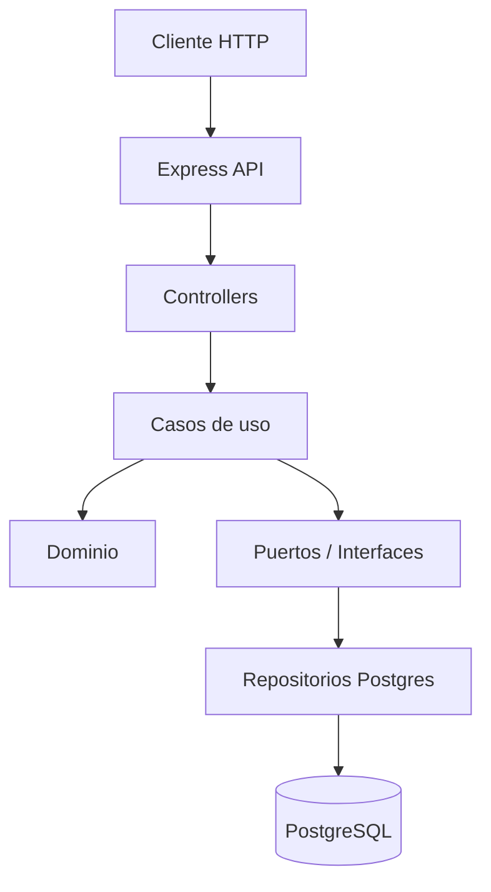
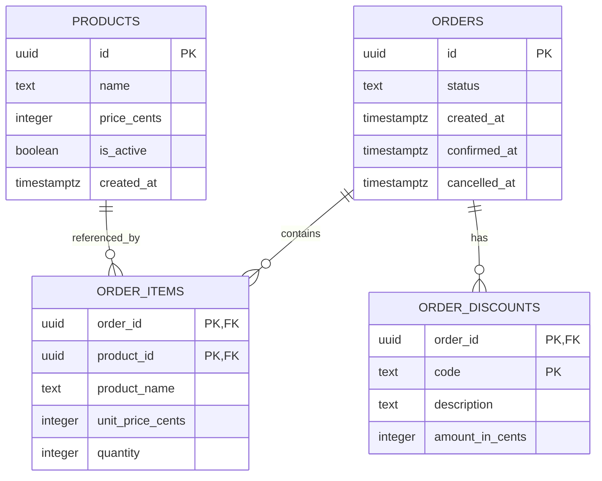

# MiniOrder

MiniOrder es un proyecto base en **TypeScript** para practicar diseño y arquitectura de software mediante una API sencilla de gestión de pedidos.

El sistema modela un flujo básico de negocio con **productos**, **órdenes**, **ítems de orden** y **descuentos asociados**. La intención principal del proyecto es servir como laboratorio para aplicar arquitectura hexagonal, principios de DDD, casos de uso, puertos, adaptadores, persistencia y composición manual de dependencias.

## Descripción general

La aplicación expone una API HTTP construida con **Express** y persiste la información en **PostgreSQL**.

Flujo principal:

1. Crear productos.
2. Consultar productos.
3. Crear órdenes en estado `draft`.
4. Agregar productos a una orden.
5. Aplicar descuentos a una orden en base a reglas.
6. Confirmar una orden.
7. Cancelar una orden.
8. Consultar órdenes.

El proyecto no busca esconder la arquitectura detrás de un framework pesado. La composición de dependencias se realiza de forma explícita, lo que permite entender mejor cómo se conectan las capas.

## Arquitectura

La aplicación sigue una arquitectura inspirada en **hexagonal / DDD**.



Responsabilidades principales:

| Capa             | Responsabilidad                                                                  |
| ---------------- | -------------------------------------------------------------------------------- |
| `domain`         | Reglas de negocio, entidades, invariantes y lógica central.                      |
| `application`    | Casos de uso, orquestación del flujo y definición de puertos.                    |
| `infrastructure` | Adaptadores concretos: HTTP, PostgreSQL, mappers, logging, configuración.        |
| `composition`    | Punto donde se conectan dependencias concretas con casos de uso y controladores. |
| `shared`         | Utilidades transversales compartidas por distintas capas.                        |
| `main.ts`        | Punto de entrada de la aplicación.                                               |

La dirección esperada de dependencias es:

```text
infrastructure → application → domain
composition → infrastructure/application/domain
```

El dominio no debería depender de Express, PostgreSQL, variables de entorno ni detalles de infraestructura.

## Estructura del proyecto

```text
miniorder/
├── db/
│   └── migrations/
│       └── 001_init.sql
├── docs/
│   └── miniorder-api/
├── src/
│   ├── application/
│   │   ├── order/
│   │   │   ├── AddItemToOrderUseCase.ts
│   │   │   ├── CancelOrderUseCase.ts
│   │   │   ├── ConfirmOrderUseCase.ts
│   │   │   ├── CreateOrderUseCase.ts
│   │   │   ├── GetOrderUseCase.ts
│   │   │   ├── ListOrdersUseCase.ts
│   │   │   └── OrderDTO.ts
│   │   ├── ports/
│   │   │   ├── OrderRepository.ts
│   │   │   └── ProductRepository.ts
│   │   └── product/
│   │       ├── CreateProductUseCase.ts
│   │       ├── GetProductUseCase.ts
│   │       ├── ListProductsUseCase.ts
│   │       └── ProductDTO.ts
│   ├── composition/
│   │   └── container.ts
│   ├── domain/
│   │   ├── discount/
│   │   │   ├── policies/
│   │   │   ├── OrderDiscountService.ts
│   │   │   └── DiscountPolicy.ts
│   │   ├── order/
│   │   │   ├── Order.ts
│   │   │   ├── OrderItem.ts
│   │   │   └── OrderStatus.ts
│   │   └── product/
│   │       └── Product.ts
│   ├── infrastructure/
│   │   ├── config/
│   │   │   └── env.ts
│   │   ├── database/postgres/
│   │   │   ├── createPostgresPool.ts
│   │   │   └── runPostgresMigrations.ts
│   │   ├── http/
│   │   │   ├── controllers/
│   │   │   │   ├── OrderController.ts
│   │   │   │   └── ProductController.ts
│   │   │   ├── middlewares/
│   │   │   │   ├── errorMiddleware.ts
|   |   |   |   └── httpLoggerMiddleware.ts
│   │   │   ├── routes/
│   │   │   │   ├── orderRoutes.ts
│   │   │   │   └── productRoutes.ts
│   │   │   └── createApp.ts
│   │   └── repositories/
│   │       ├── memory/
│   │       └── postgres/
│   │           ├── mappers/
│   │           │   ├── orderPersistenceMapper.ts
│   │           │   └── productPersistenceMapper.ts
│   │           ├── PostgresOrderRepository.ts
│   │           └── PostgresProductRepository.ts
│   ├── shared/
│   │   ├── AppError.ts
│   │   ├── IdGenerator.ts
│   │   └── Logger.ts
│   └── main.ts
├── tests/
│   ├── integration/
│   └── unit/
├── docker-compose.yml
├── Dockerfile
├── package.json
├── pnpm-lock.yaml
├── tsconfig.json
└── vitest.config.ts
```

## Diagrama de base de datos



Tablas principales:

| Tabla             | Descripción                                                       |
| ----------------- | ----------------------------------------------------------------- |
| `products`        | Catálogo de productos disponibles para vender.                    |
| `orders`          | Órdenes creadas por el sistema y su estado actual.                |
| `order_items`     | Productos agregados a una orden, con snapshot de nombre y precio. |
| `order_discounts` | Descuentos aplicados a una orden.                                 |

La migración inicial se encuentra en:

```text
db/migrations/001_init.sql
```

## Documentación de API

La documentación y colección de peticiones se encuentra en:

```text
docs/miniorder-api/
```

Puede abrirse con **Bruno** para probar los endpoints de forma local.

---

## Requisitos

- Node.js
- pnpm `11.9.0`
- Docker
- Docker Compose

## Variables de entorno

Crear un archivo `.env` a partir de `.env.example`:

```bash
cp .env.example .env
```

## Instalación y uso local — Dev

Este modo levanta solo PostgreSQL con Docker y ejecuta la API directamente en la máquina local.

### 1. Instalar dependencias

```bash
pnpm install
```

### 2. Crear archivo de entorno

```bash
cp .env.example .env
```

Asegurarse de que `DB_HOST` apunte a `localhost`:

```env
DB_HOST=localhost
DB_PORT=5432
```

### 3. Levantar solo PostgreSQL

```bash
docker compose up -d postgres
```

### 4. Ejecutar migración inicial

```bash
pnpm run db:migrate
```

La migración usa `CREATE TABLE IF NOT EXISTS`, por lo que puede ejecutarse nuevamente sin recrear las tablas existentes.

### 5. Ejecutar la API en modo desarrollo

```bash
pnpm dev
```

La API quedará disponible en:

```text
http://localhost:3000
```

## Uso con Docker — Prod

Este modo levanta la API y PostgreSQL usando `docker-compose.yml`.

### 1. Construir y levantar servicios

```bash
docker compose up --build -d
```

Servicios principales:

| Servicio   | Descripción                                   | Puerto |
| ---------- | --------------------------------------------- | ------ |
| `api`      | API Express construida desde el `Dockerfile`. | `3000` |
| `postgres` | Base de datos PostgreSQL.                     | `5432` |

### 2. Ejecutar migración inicial

```bash
pnpm run db:migrate
```

### 3. Ver logs

```bash
docker compose logs -f api
```

### 4. Detener servicios

```bash
docker compose down
```

Para eliminar también los datos persistidos de PostgreSQL:

```bash
docker compose down -v
```

## Ejecución de pruebas

En el proyecto se usan **Vitest** y **Supertest** para pruebas unitarias e integración.

Para ejecutar todas las pruebas:

```bash
pnpm test
```

Para ejecutar pruebas en modo watch:

```bash
pnpm test:watch
```

## Scripts disponibles

| Comando           | Descripción                                          |
| ----------------- | ---------------------------------------------------- |
| `pnpm dev`        | Ejecuta la API en modo desarrollo con `tsx --watch`. |
| `pnpm build`      | Compila TypeScript hacia `dist/`.                    |
| `pnpm start`      | Ejecuta la versión compilada desde `dist/main.js`.   |
| `pnpm test`       | Ejecuta las pruebas con Vitest.                      |
| `pnpm test:watch` | Ejecuta Vitest en modo watch.                        |
| `pnpm lint`       | Ejecuta ESLint.                                      |
| `pnpm format`     | Formatea el proyecto con Prettier.                   |
| `pnpm check`      | Compila y ejecuta las pruebas.                       |

## Stack principal

- TypeScript
- Express
- PostgreSQL
- pg
- Zod
- Pino
- Vitest
- Supertest
- Docker
- Bruno

## Objetivo del proyecto

Este proyecto está diseñado como una base práctica para estudiar arquitectura de software desde un caso pequeño pero realista.

Permite practicar:

- Separación entre dominio, aplicación e infraestructura.
- Casos de uso como frontera de entrada al negocio.
- Puertos e implementaciones concretas.
- Repositorios PostgreSQL con mapeo entre datos crudos y dominio.
- Composición manual de dependencias.
- Pruebas unitarias e integración.
- Persistencia con SQL explícito.
- Ejecución local y contenerizada.
